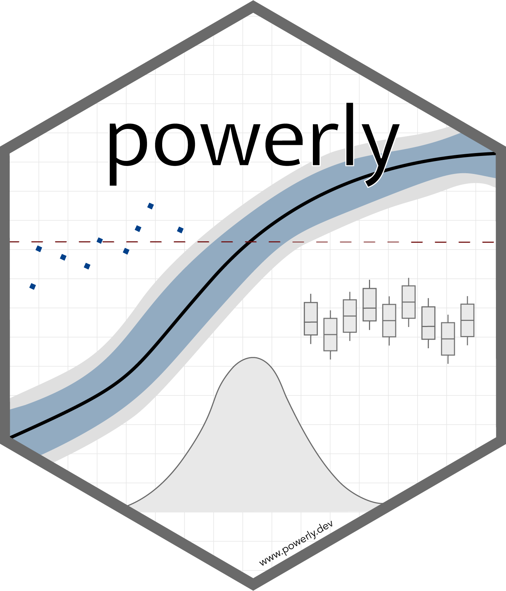

<p align="center">
    <a href="https://powerly.dev">
        
    </a>
</p>

<h1 align="center">
    Sample Size Analysis Framework
    <br>
    <sub>...and more</sub>
</h1>

<p align="center">
    <a href="https://www.repostatus.org/#active"></a>
    <a href="https://github.com/mihaiconstantin/powerly/releases"></a>
    <a href="https://www.r-pkg.org/pkg/powerly"></a>
    <a href="https://www.r-pkg.org/pkg/powerly"></a>
    <a href="https://app.codecov.io/gh/mihaiconstantin/powerly"></a>
    <a href="https://github.com/mihaiconstantin/powerly/actions"></a>
    <a href="https://cran.rstudio.com/web/checks/check_results_powerly.html"></a>
    <a href="https://powerly.dev"></a>
    <a href="https://raw.githubusercontent.com/mihaiconstantin/powerly/main/inst/design/powerly-design.drawio.svg"></a>
</p>

## Description

[`powerly`](https://powerly.dev) is an `R` package that provides a general
framework for sample size analysis...

## Installation

You can install `powerly` directly from `CRAN` using the following command:

```r
# Install the package from `CRAN`.
install.packages("powerly")

# Load the package.
library(powerly)
```

Alternatively, you can also install the latest development version from `GitHub`
via:

```r
# Install the package from `GitHub`.
remotes::install_github("mihaiconstantin/powerly")

# Load the package.
library(powerly)
```

## Usage

*To be added.*

## Contributing

- Any contributions are welcome and greatly appreciated. Please open a [pull
  request](https://github.com/mihaiconstantin/powerly/pulls) on `GitHub`.
- To report bugs, or request new features, please open an
  [issue](https://github.com/mihaiconstantin/powerly/issues) on `GitHub`.


## License

- The package source code in this repository is licensed under the [MIT license](https://opensource.org/license/mit/).
- <p class="license-cc" xmlns:cc="https://creativecommons.org/ns#" xmlns:dct="https://purl.org/dc/terms/"><a property="dct:title" rel="cc:attributionURL" href="https://powerly.dev">The documentation, vignettes, and other website materials</a> by <a rel="cc:attributionURL dct:creator" property="cc:attributionName" href="https://mihaiconstantin.com">Mihai Constantin</a> are licensed under <a href="https://creativecommons.org/licenses/by/4.0/?ref=chooser-v1" target="_blank" rel="license noopener noreferrer" style="display:inline-block;">CC BY 4.0  </a>.</p>

To use `powerly` please cite:

- Constantin, M. A., Schuurman, N. K., & Vermunt, J. K. (2023). A General Monte Carlo Method for Sample Size Analysis in the Context of Network Models. _Psychological Methods_. [https://doi.org/10.1037/met0000555](https://doi.org/10.1037/met0000555).
- Constantin, M. A., Schuurman, N. K., & Vermunt, J. K. (2024). A General Framework for Sample Size Analysis and a Tutorial Using Structural Equation Modeling. PsyArXiv. [https://doi.org](https://doi.org).
