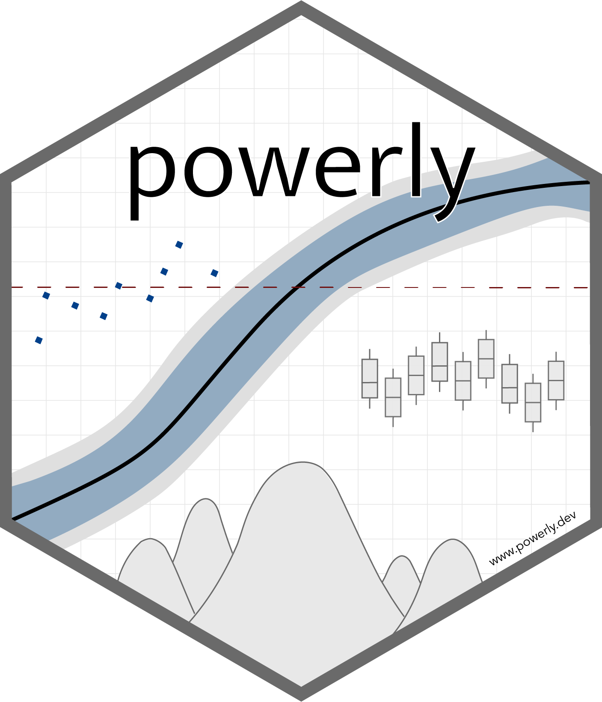
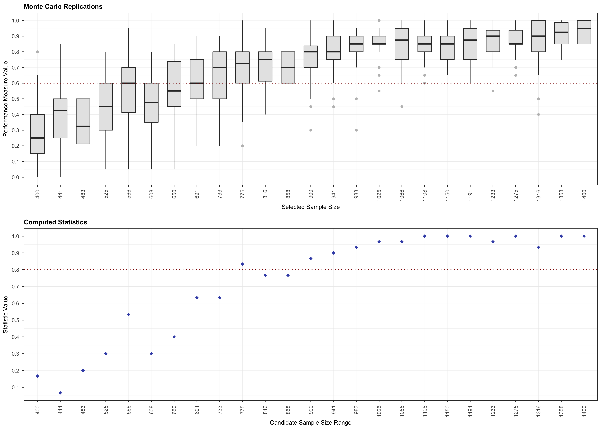
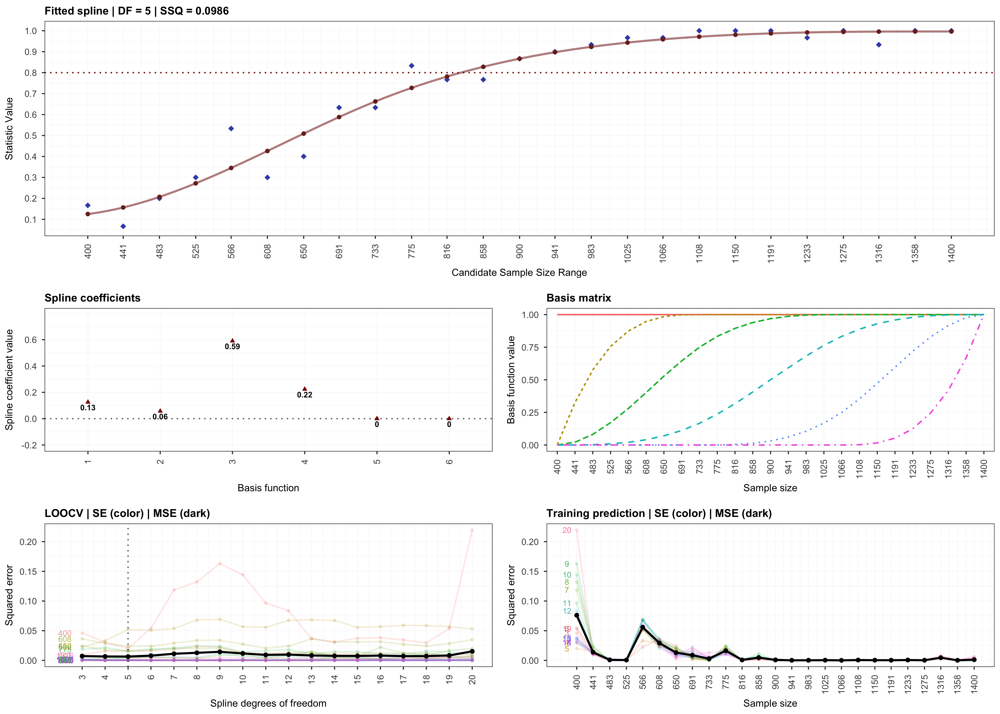
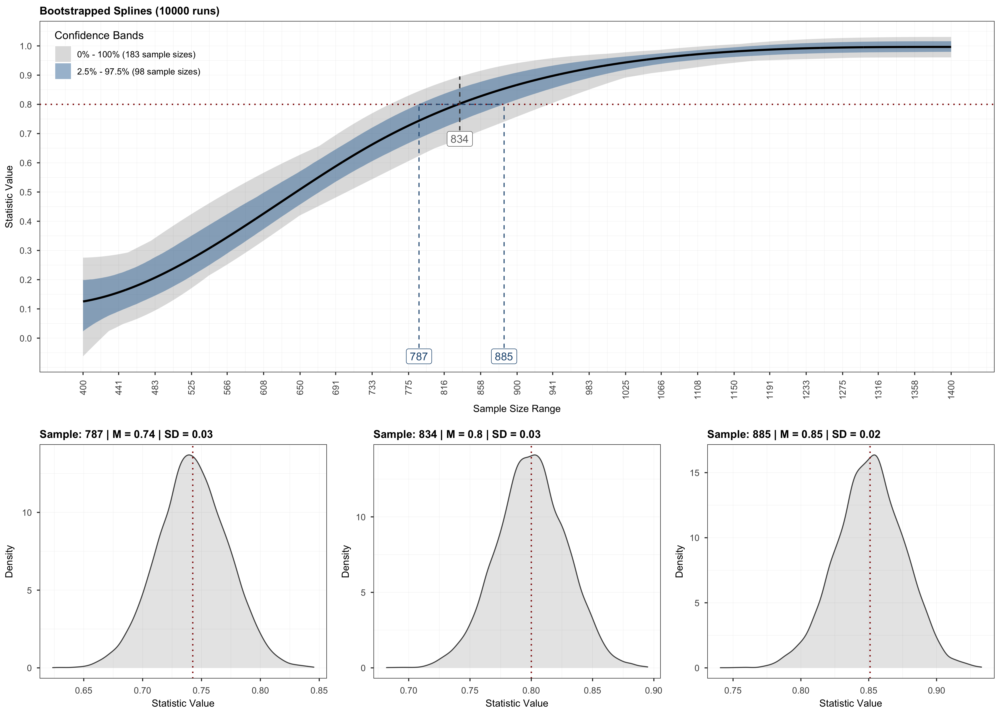
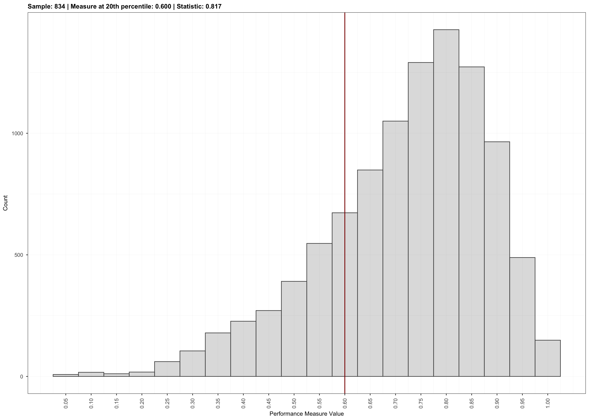
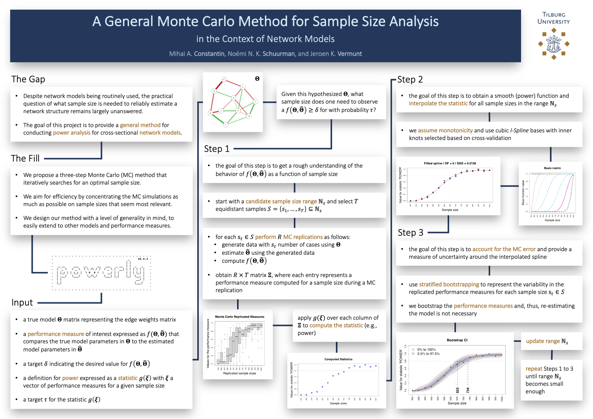

<p align="center">
    <a href="https://powerly.dev">
        
    </a>
</p>

<h1 align="center">
    Sample Size Analysis for Psychological Networks
    <br>
    <sub>...and more</sub>
</h1>

<p align="center">
    <a href="https://www.repostatus.org/#active"></a>
    <a href="https://github.com/mihaiconstantin/powerly/releases"></a>
    <a href="https://www.r-pkg.org/pkg/powerly"></a>
    <a href="https://www.r-pkg.org/pkg/powerly"></a>
    <a href="https://app.codecov.io/gh/mihaiconstantin/powerly"></a>
    <a href="https://github.com/mihaiconstantin/powerly/actions"></a>
    <a href="https://cranchecks.info/pkgs/powerly"></a>
</p>

## Description

`powerly` is an `R` package that implements the method by [Constantin et al.
(2021)](https://psyarxiv.com/j5v7u) for conducting sample size analysis for
cross-sectional network models. The method implemented is implemented in the
main function `powerly`()`. The implementation takes the form of a three-step
recursive algorithm designed to find an optimal sample size value given a model
specification and an outcome measure of interest. It starts with a Monte Carlo
simulation step for computing the outcome at various sample sizes. Then, it
continues with a monotone curve-fitting step for interpolating the outcome. The
final step employs stratified bootstrapping to quantify the uncertainty around
the fitted curve.

---

<div align="center">
    Check out the documentation and tutorials at
    <h3>
        <a href="https://powerly.dev">powerly.dev</a>
    </h3>
</div>

---

## Installation

- to install from CRAN run `install.packages("powerly")`
- to install the latest version from GitHub run `remotes::install_github("mihaiconstantin/powerly")`

---

## Example

The code block below illustrates the main function in the package. For more
information, see the documentation `?powerly`, or check out the tutorials at
[powerly.dev](https://powerly.dev).

```r
# Suppose we want to find the sample size for observing a sensitivity of `0.6`
# with a probability of `0.8`, for a GGM true model consisting of `10` nodes
# with a density of `0.4`.

# We can run the method for an arbitrarily generated true model that matches
# those characteristics (i.e., number of nodes and density).
results <- powerly(
    range_lower = 300,
    range_upper = 1000,
    samples = 30,
    replications = 20,
    measure = "sen",
    statistic = "power",
    measure_value = .6,
    statistic_value = .8,
    model = "ggm",
    nodes = 10,
    density = .4,
    cores = 2,
    verbose = TRUE
)

# Or we omit the `nodes` and `density` arguments and specify directly the edge
# weights matrix via the `model_matrix` argument.

# To get a matrix of edge weights we can use the `generate_model()` function.
true_model <- generate_model(type = "ggm", nodes = 10, density = .4)

# Then, supply the true model to the algorithm directly.
results <- powerly(
    range_lower = 300,
    range_upper = 1000,
    samples = 30,
    replications = 20,
    measure = "sen",
    statistic = "power",
    measure_value = .6,
    statistic_value = .8,
    model = "ggm",
    model_matrix = true_model, # Note the change.
    cores = 2,
    verbose = TRUE
)
```

To validate the results of the analysis, we can use the `validate()` method. For
more information, see the documentation `?validate`.

```r
# Validate the recommendation obtained during the analysis.
validation <- validate(results)
```

To visualize the results, we can use the `plot` function and indicate the step
that should be plotted.

```r
# Step 1.
plot(results, step = 1)
```
<p align="center">
    
</p>

```r
# Step 2.
plot(results, step = 2)
```
<p align="center">
    
</p>

```r
# Step 3.
plot(results, step = 3)
```

<p align="center">
    
</p>

```r
# Validation.
plot(validation)
```

<p align="center">
    
</p>

---

## Contributing

- *To support* a new model, performance measure, or statistic, please open a
  [pull request](https://github.com/mihaiconstantin/powerly/pulls) on GitHub.
- *To request* a new model, performance measure, or statistic, please open an
  [issue](https://github.com/mihaiconstantin/powerly/issues) on GitHub. If
  possible, also include references discussing the topics you are requesting.

---

## Poster

<p align="center">
    
</p>

---

## License

The code in this repository is licensed under the [MIT license](https://opensource.org/licenses/MIT).

To use `powerly` please cite:
- Constantin, M. A., Schuurman, N. K., & Vermunt, J. (2021). A General Monte Carlo Method for Sample Size Analysis in the Context of Network Models. PsyArXiv. [https://doi.org/10.31234/osf.io/j5v7u](https://doi.org/10.31234/osf.io/j5v7u)
